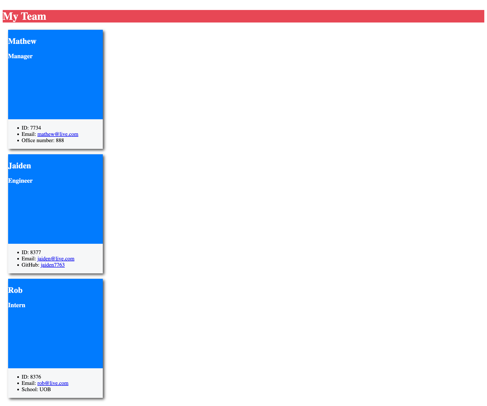

# Tean-Profile-Generator

## Description 
This application was created to generate a team profile based on user input using the Inquirer module from Node.js and displaying the information on a newly created html page with a style sheet. This project demonstrates use of OOP and TDD using Jest. 
 
## Table of Contents
* [Installation](#installation)
* [Usage](#usage)
* [License](#license)
* [Contributing](#contributing)
* [Tests](#tests)
* [Questions](#questions)

## Installation

1. To install application, clone the main project via the HTTP or SSH link on github.

```
git clone
```

2. Once cloned, open up the project folder in your text editor and run the following command in terminal to install all dependencies.

```
npm install
```

## License 
This project is license under MIT 

## Tests
Run `npm run test` to run Jest for tests on constructors.

## Here is the sample HTML

